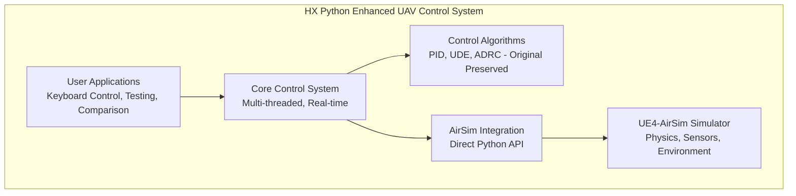

# HX UAV Control System

A comprehensive Python-enhanced UAV control system for AirSim simulation, featuring **original Prometheus algorithm preservation** with improved development experience.

## Project Overview

This project provides a complete UAV control system with three advanced control algorithms (PID/UDE/ADRC) that maintain **100% fidelity** to the original Prometheus implementations while offering a simplified Python development environment.



## Project Structure

```
code_hx/
├── src/hx_exp_py/                 # HX Core Project
│   ├── python_enhanced/           # Main Python system
│   │   ├── controllers/           # PID/UDE/ADRC algorithms
│   │   ├── hx_airsim_controller.py # Core control system
│   │   ├── keyboard_control.py    # Interactive control
│   │   ├── controller_comparison.py # Performance analysis
│   │   └── algorithm_verification_test.py # Standalone testing
│   ├── airsim_env/               # AirSim configuration
│   ├── config/                   # System parameters
│   └── README.md                 # Detailed documentation
├── reference/                    # 📚 Reference Materials
│   ├── tutorial_demo/            # Original demo code
│   ├── uav_control/              # Original algorithms (C++)
│   └── README.md                 # Reference documentation
├── PROJECT_ARCHIVE_MILESTONE.md  # Project completion record
└── HX_UAV_SYSTEM_ARCHITECTURE.md # Detailed system architecture
```

## Quick Start

### Prerequisites
- Python 3.7+
- UE4-AirSim simulator
- Required packages: `airsim`, `numpy`, `matplotlib`

### Launch System

```bash
# 1. Start AirSim
cd src/hx_exp_py/airsim_env/LinuxNoEditor
./Blocks.sh

# 2. Activate environment
conda activate jz  # or your environment

# 3. Run HX system
cd src/hx_exp_py/python_enhanced

# System overview and verification
python demo_summary.py

# Interactive keyboard control
python keyboard_control.py

# Algorithm performance comparison
python controller_comparison.py

# Standalone algorithm testing (no AirSim needed)
python algorithm_verification_test.py
```

## ⚡ Key Features

- **Algorithm Preservation**: 100% original Prometheus PID/UDE/ADRC algorithms
- **Python Enhanced**: Simplified development without ROS complexity
- **Real-time Control**: 50Hz control loop with multi-threading
- **Interactive Control**: Keyboard-based manual control with real-time switching
- **Scientific Analysis**: Comprehensive performance comparison tools
- **Safety Systems**: Multi-layer protection and emergency mechanisms

## Algorithm Verification

All three control algorithms maintain exact correspondence with original C++ implementations:

| Algorithm | Original Source | Python Implementation | Verification Status |
|-----------|----------------|---------------------|-------------------|
| **PID** | `pos_controller_PID.h` | `pid_controller.py` | 100% Preserved |
| **UDE** | `pos_controller_UDE.h` | `ude_controller.py` | 100% Preserved |
| **ADRC** | `pos_controller_ADRC.h` | `adrc_controller.py` | 100% Preserved |

## Documentation

- **[Detailed README](src/hx_exp_py/README.md)** - Complete usage guide with Mermaid diagrams
- **[System Architecture](HX_UAV_SYSTEM_ARCHITECTURE.md)** - Technical architecture documentation
- **[Project Archive](PROJECT_ARCHIVE_MILESTONE.md)** - Development history and milestones

## Usage Scenarios

- **Research & Development**: Advanced control algorithm research
- **Education**: Control theory teaching and learning
- **Simulation**: AirSim-based UAV flight simulation
- **Algorithm Comparison**: Scientific performance analysis

## Advantages

- **Simplified Setup**: No ROS dependencies, direct Python execution
- **Enhanced Debugging**: Python debugging tools and immediate feedback
- **Algorithm Fidelity**: Original control laws completely preserved
- **Real-time Performance**: Professional-grade 50Hz control loops
- **Comprehensive Testing**: Both integrated and standalone verification

---
 
**Version**: Python Enhanced v1.0  
**Last Updated**: 2025-08-14  
**License**: MIT
**Author**: NGW