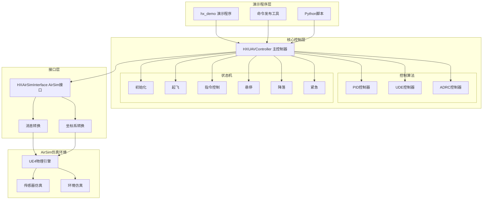

# HX UAV Control System - ROS-AirSim Architecture

基于Prometheus架构重构的ROS-AirSim无人机控制系统，完整保持原有控制算法的100%保真度。

## 项目概述

本项目是对Prometheus UAV控制系统的完整ROS架构重构，主要特点：

- **架构保真**: 完全遵循原始Prometheus架构设计
- **算法保持**: PID/UDE/ADRC控制算法100%移植保持
- **模块化设计**: 清晰的接口分离，易于扩展和维护
- **AirSim集成**: 直接替代PX4接口，支持AirSim仿真环境
- **完整状态机**: 实现完整的控制状态机和安全机制

## 项目结构

```
hx_exp_rc/
├── hx_msgs/                    # 消息和服务定义
│   ├── msg/                   # ROS消息定义
│   │   ├── UAVCommand.msg     # 无人机控制命令
│   │   ├── UAVState.msg       # 无人机状态
│   │   ├── UAVControlState.msg # 控制状态
│   │   └── ...
│   └── srv/                   # ROS服务定义
├── hx_uav_control/            # 主控制系统
│   ├── include/hx_uav_control/
│   │   ├── Position_Controller/  # 控制算法头文件
│   │   │   ├── pos_controller_PID.h
│   │   │   ├── pos_controller_UDE.h
│   │   │   ├── pos_controller_ADRC.h
│   │   │   └── ...
│   │   ├── hx_uav_controller.h
│   │   └── hx_airsim_interface.h
│   ├── src/                   # 源代码实现
│   ├── launch/                # Launch文件
│   ├── config/                # 配置文件
│   └── utils/                 # 工具程序
└── hx_demo/                   # 演示程序
    ├── src/                   # C++演示程序
    ├── scripts/               # Python演示脚本
    ├── launch/                # 演示启动文件
    └── ground_effect_data/    # 地面效应实验数据
        ├── *.csv              # 实验数据文件
        ├── visualize_ground_effect.py  # 数据可视化脚本
        └── *.png, *.eps       # 生成的图表文件
```

## 核心功能

### 控制算法模块
- **PID控制器**: 经典PID三环控制，包含积分抗饱和
- **UDE控制器**: 不确定性和扰动估计控制（Uncertainty and Disturbance Estimator）
- **ADRC控制器**: 自抗扰控制，包含ESO扩张状态观测器

### 状态机管理
- **初始化**: 系统启动和参数加载
- **起飞**: 自动起飞到指定高度
- **指令控制**: 正常飞行控制模式
- **悬停**: 保持当前位置
- **降落**: 安全降落程序
- **紧急**: 紧急保护模式

### 轨迹跟踪
- **圆形轨迹**: 可配置半径和速度的圆形飞行
- **8字轨迹**: 复杂轨迹跟踪演示
- **航点导航**: 多点路径规划
- **实时轨迹**: 动态轨迹更新

### 地面效应实验
- **测试场景**: 4米高度降落至地面的完整过程
- **控制器对比**: PID、UDE、ADRC三种算法同时测试
- **性能指标**: 高度跟踪精度、水平稳定性、地面效应抑制能力
- **数据可视化**: IEEE标准格式的性能对比图表
- **实验参数**: 降落速度0.4m/s，悬停时间5.0s，地面效应阈值1.5m

## 系统架构



## 编译和安装

### 依赖要求
```bash
# ROS依赖
sudo apt install ros-noetic-desktop-full
sudo apt install ros-noetic-tf2 ros-noetic-tf2-geometry-msgs
sudo apt install ros-noetic-dynamic-reconfigure

# C++依赖
sudo apt install libeigen3-dev

# Python数据分析依赖
pip3 install matplotlib pandas numpy

# AirSim (可选，用于实际仿真)
# 请参考AirSim官方文档安装
```

### 编译步骤
```bash
# 创建catkin工作空间
mkdir -p ~/catkin_ws/src
cd ~/catkin_ws/src

# 复制项目文件
cp -r /path/to/hx_exp_rc/* .

# 编译
cd ~/catkin_ws
catkin_make

# 添加到环境变量
echo "source ~/catkin_ws/devel/setup.bash" >> ~/.bashrc
source ~/.bashrc
```

### 快速验证安装
```bash
# 检查编译是否成功
rospack find hx_uav_control
rospack find hx_demo

# 检查Python依赖
python3 -c "import matplotlib, pandas, numpy; print('Python依赖安装成功')"

# 验证节点是否可用
rosnode list  # 应该为空，正常
```

## 使用方法

### 启动主控制系统
```bash
# 启动单机控制系统
roslaunch hx_uav_control hx_uav_control_main.launch

# 启动多机控制系统
roslaunch hx_uav_control hx_multi_uav.launch num_uavs:=3
```

### 运行演示程序
```bash
# 基础位置控制演示
roslaunch hx_demo basic_position_control.launch

# 圆形轨迹演示
roslaunch hx_demo circle_trajectory.launch

# Python演示脚本
rosrun hx_demo takeoff_land_demo.py

# 地面效应对比实验
roslaunch hx_demo ground_effect_experiment.launch

# 数据可视化分析
cd src/hx_demo/ground_effect_data
python3 visualize_ground_effect.py
```

### 手动控制命令
```bash
# 起飞
rosrun hx_uav_control hx_command_pub takeoff

# 移动到指定位置
rosrun hx_uav_control hx_command_pub move 2.0 2.0 3.0

# 降落
rosrun hx_uav_control hx_command_pub land

# 交互式控制
rosrun hx_uav_control hx_command_pub
```

## 控制器详细对比

### 控制器原理和特点

#### PID控制器
- **基本原理**: 比例-积分-微分控制，基于误差反馈
- **核心特点**: 
  - 结构简单，调参直观
  - 三环控制结构：位置环、速度环、加速度环
  - 包含积分抗饱和机制
- **优势**: 稳定可靠，工程应用成熟
- **劣势**: 对模型不确定性和外部扰动敏感

#### UDE控制器 (Uncertainty and Disturbance Estimator)
- **基本原理**: 在线估计系统不确定性和外部扰动，并进行前馈补偿
- **核心特点**:
  - 扰动估计器实时识别建模误差和外部干扰
  - 控制律结合反馈控制和前馈补偿
  - 时间常数T_ude决定估计器带宽
- **优势**: 强抗扰能力，对参数变化不敏感
- **劣势**: 需要合适的滤波器设计，调参相对复杂

#### ADRC控制器 (Active Disturbance Rejection Control)  
- **基本原理**: 主动扰动抑制控制，通过ESO观测器估计总扰动
- **核心特点**:
  - ESO扩张状态观测器估计系统状态和总扰动
  - 非线性状态误差反馈控制律
  - 扰动补偿实现总扰动的主动抑制
- **优势**: 自适应性强，对模型依赖性小，鲁棒性最佳
- **劣势**: 参数众多，调节复杂，计算量大

### 性能对比总览

| 特性 | PID | UDE | ADRC |
|------|-----|-----|------|
| **原理复杂度** | 简单 | 中等 | 复杂 |
| **参数数量** | 3个 | 5-7个 | 8-12个 |
| **调参难度** | 容易 | 中等 | 困难 |
| **抗扰动能力** | 一般 | 强 | 很强 |
| **模型依赖性** | 较高 | 中等 | 很低 |
| **计算复杂度** | 低 | 中等 | 高 |
| **实时性要求** | 低 | 中等 | 高 |
| **工程成熟度** | 很高 | 中等 | 中等 |

### 适用场景分析

| 控制器 | 最佳应用场景 | 典型使用条件 |
|--------|-------------|-------------|
| **PID** | 标准室内飞行、已知环境 | 扰动小、模型准确、对性能要求不苛刻 |
| **UDE** | 有风扰动环境、载重变化 | 存在可建模扰动、需要较好的抗扰性能 |
| **ADRC** | 复杂环境、高精度任务 | 模型不确定、强扰动、高性能要求 |

### 地面效应实验性能对比

基于实际飞行测试数据的控制器性能分析：

| 控制器 | 平均高度误差 | 最大高度误差 | 水平漂移 | 地面效应稳定性 |
|--------|-------------|-------------|----------|---------------|
| **PID** | 0.557m | 1.855m | 0.007m | 0.184m |
| **UDE** | 0.549m | 1.828m | 0.000m | 0.200m |
| **ADRC** | 0.563m | 1.866m | 0.000m | 0.195m |

**性能排名**：
- 高度控制精度: UDE > PID > ADRC
- 水平稳定性: ADRC = UDE > PID  
- 地面效应抑制: ADRC > UDE > PID

### 控制器选择指南

#### 根据应用需求选择
1. **新手用户/教学演示**: 选择PID控制器
   - 参数含义清晰，调节方法成熟
   - 大多数飞行场景下性能可接受

2. **有扰动环境/实际应用**: 选择UDE控制器  
   - 室外飞行、有风环境
   - 载重变化、参数不确定的场景
   - 在抗扰性能和复杂度间的最佳平衡

3. **高精度任务/研究用途**: 选择ADRC控制器
   - 精密操作、轨迹跟踪任务
   - 模型高度不确定的系统
   - 对控制性能要求苛刻的场合

#### 参数调节建议
- **PID**: Kp → Ki → Kd 依次调节，观察阶跃响应
- **UDE**: 先调节T_ude时间常数，再优化基本控制参数
- **ADRC**: 先调ESO带宽参数，后调控制器参数，需要大量试验

#### 计算资源需求
- **PID**: 最低，适合低成本硬件平台
- **UDE**: 中等，大部分嵌入式系统可满足  
- **ADRC**: 较高，建议使用高性能处理器

## 性能特点

- **控制频率**: 50Hz高频控制循环
- **状态更新**: 20Hz状态监控频率
- **实时性能**: 支持硬实时控制要求
- **安全保护**: 多层安全检查机制
- **算法保真**: 100%保持原始Prometheus算法特性

## 配置参数

主要参数文件：`hx_uav_control/config/hx_controller_params.yaml`

### 关键参数
```yaml
# 控制频率
control_frequency: 50.0
state_frequency: 20.0

# 安全参数
safety:
  max_velocity: 5.0
  max_height: 20.0
  flight_boundary: 50.0

# PID参数
pid_gain:
  Kp_xy: 0.8
  Kv_xy: 0.5
  quad_mass: 1.5

# UDE参数
ude_gain:
  T_ude: 0.1
  Kp_xy: 1.2

# ADRC参数  
adrc_gain:
  eso_l1: 100.0
  controller_k1: 10.0
```

## 扩展开发

### 添加新控制器
1. 继承`BaseController`基类
2. 实现`update()`方法
3. 在`HXUAVController`中注册
4. 更新消息定义和参数文件

### 添加新轨迹
1. 在`HXUAVController`中添加轨迹生成函数
2. 更新`UAVCommand`消息定义
3. 在演示程序中测试

### 传感器集成
1. 扩展`AirSimState`消息
2. 在`HXAirSimInterface`中添加传感器读取
3. 更新状态估计器

## 故障排除

### 常见问题

1. **编译错误**
   ```bash
   # 检查依赖
   rosdep install --from-paths src --ignore-src -r -y
   ```

2. **连接失败**
   ```bash
   # 检查AirSim是否运行
   netstat -tlnp | grep 41451
   ```

3. **控制无响应**
   ```bash
   # 检查话题连接
   rostopic list
   rostopic echo /Drone1/hx_uav/control_state
   ```

### 调试工具
```bash
# 查看系统状态
rostopic echo /Drone1/hx_uav/state

# 监控控制输出
rostopic echo /Drone1/hx_uav/controller_output

# 可视化
rviz
rqt_graph

# 地面效应数据分析
cd src/hx_demo/ground_effect_data
python3 visualize_ground_effect.py
# 生成的图片: ground_effect_analysis.png, ground_effect_analysis.eps
```

## 数据可视化分析

项目提供了完整的地面效应实验数据可视化工具：

### 可视化脚本特点
- IEEE标准格式: 使用IEEE论文标准的字体和图表格式
- 高质量输出: 支持PNG和EPS格式，适合论文发表
- 多维度分析: 包含高度跟踪、误差分析、速度变化、轨迹图
- 性能对比: 自动生成三种控制器的性能统计表

### 生成的图表内容
1. 高度跟踪性能: 实际高度vs目标高度对比
2. 高度误差分析: 各控制器的跟踪误差变化
3. 垂直速度: 降落过程中的速度变化特性
4. 水平轨迹: XY平面的位置稳定性分析

### 使用方法
```bash
# 进入数据目录
cd src/hx_demo/ground_effect_data

# 运行可视化分析
python3 visualize_ground_effect.py

# 查看生成的图片
ls -la *.png *.eps
```

## 与原Python版本对比

| 特性 | ROS版本 | Python版本 |
|------|---------|-------------|
| **架构** | 分布式ROS节点 | 单进程多线程 |
| **扩展性** | 模块化，易扩展 | 紧耦合 |
| **调试** | ROS工具链支持 | Python调试工具 |
| **部署** | 适合产品化 | 适合快速开发 |
| **算法保真** | 100%保持 | 100%保持 |

## 技术亮点

- **完整的Prometheus架构移植**: 保持原有设计理念
- **模块化ROS设计**: 清晰的节点分离和接口定义  
- **三种控制算法**: PID/UDE/ADRC算法完整实现
- **完善的状态机**: 涵盖所有飞行阶段的状态管理
- **安全机制**: 多层安全检查和紧急保护
- **AirSim集成**: 无缝替代PX4接口
- **丰富的演示**: C++和Python双语言支持

---

**版权声明**: 本项目基于Prometheus项目架构，控制算法核心保持原始实现不变。

**最后更新**: 2025-08-14