# HX UAV Control System - Python Enhanced Version

A comprehensive UAV control system for UE-AirSim simulation environment, featuring advanced control algorithms with **original Prometheus algorithm cores preserved**. This Python-enhanced version provides better development experience while maintaining algorithm fidelity.

## ✨ Features

### 🎯 Core Philosophy
- **Algorithm Preservation**: All control algorithms (PID/UDE/ADRC) maintain original Prometheus implementation
- **Python Enhancement**: Simplified development experience without ROS complexity  
- **Direct AirSim Integration**: Native Python API integration for better performance

### 🚁 Advanced Control System
- **Three Control Algorithms**: 
  - **PID**: Classical PID controller with integral anti-windup
  - **UDE**: Uncertainty and Disturbance Estimator for robust control
  - **ADRC**: Active Disturbance Rejection Control with ESO
- **Multiple Control Modes**: Position, Velocity, Trajectory, Manual
- **Real-time Performance**: 50Hz control loop with multi-threading
- **Safety Systems**: Comprehensive limits, emergency stop, fault detection

### 🎮 Interactive Control
- **Keyboard Control**: Real-time manual control with multiple modes
- **Controller Switching**: Runtime switching between PID/UDE/ADRC
- **Trajectory Following**: Circle, figure-eight, waypoint navigation
- **Performance Comparison**: Scientific comparison of all three controllers

### 📊 Analysis & Verification
- **Algorithm Verification**: Standalone testing without AirSim dependency
- **Performance Metrics**: Tracking error, settling time, robustness analysis
- **Visual Results**: Matplotlib-based comparison charts and plots

## 🏗️ System Architecture


## 📋 Requirements

### Software Dependencies
- Python 3.7+
- UE-AirSim
- airsim Python package
- NumPy, Matplotlib
- (Optional) keyboard library for enhanced control

### Hardware Requirements
- Computer capable of running UE-AirSim
- Sufficient CPU/GPU for real-time simulation

## 🚀 Quick Start

### 1. Setup Environment
```bash
# Activate your conda environment
conda activate jz  # or your preferred environment

# Install required packages
pip install airsim numpy matplotlib keyboard
```

### 2. Start AirSim
```bash
# Start AirSim simulator (UE4 environment)
# Ensure AirSim is running before starting Python scripts
```

### 3. Run Demos
```bash
cd /path/to/hx_exp_py/python_enhanced

# System overview and algorithm verification
python demo_summary.py

# Interactive keyboard control
python keyboard_control.py

# Scientific controller comparison  
python controller_comparison.py

# Complete system demonstration
python demo_complete_system.py

# Standalone algorithm testing
python algorithm_verification_test.py
```

## 🎮 Available Programs

### 1. Demo Summary (`demo_summary.py`)
System overview with algorithm verification:
- Controller parameter validation
- AirSim connection testing
- Architecture comparison (ROS vs Python)
- Core algorithm preservation verification

### 2. Keyboard Control (`keyboard_control.py`)
Interactive manual control:
- **Movement**: W/S (forward/back), A/D (left/right), ↑/↓ (up/down)
- **Rotation**: ←/→ (yaw left/right)
- **Flight Control**: T (takeoff), L (land), Space (stop)
- **Controller Switching**: C (cycle through PID→UDE→ADRC)
- **Mode Switching**: M (position ↔ velocity control)

### 3. Controller Comparison (`controller_comparison.py`) 
Scientific performance comparison:
- **Step Response Testing**: Response time and overshoot analysis
- **Trajectory Tracking**: Circle and figure-eight pattern following
- **Disturbance Rejection**: Robustness testing
- **Performance Metrics**: Error analysis, settling time, accuracy
- **Visual Results**: Automatic chart generation and saving

### 4. Complete System Demo (`demo_complete_system.py`)
Comprehensive system demonstration:
- Multi-phase flight testing
- All three controllers tested sequentially
- Real-world scenario simulation
- Performance logging and analysis

### 5. Algorithm Verification (`algorithm_verification_test.py`)
Standalone algorithm testing:
- Pure mathematical simulation
- No AirSim dependency required
- Direct algorithm comparison
- Numerical performance analysis

### 6. Simple Controller Test (`simple_controller_test.py`)
Simplified AirSim integration test:
- Basic flight control verification
- Direct control command testing  
- Debugging and troubleshooting tool

## ⚙️ Configuration

### Controller Parameters
Edit parameters in the controller initialization:
```python
# Example PID parameters
pid_params = {
    'quad_mass': 1.5,
    'hov_percent': 0.6,
    'tilt_angle_max': 15.0,
    'Kp_xy': 3.0, 'Kp_z': 3.5,
    'Kv_xy': 2.0, 'Kv_z': 2.5,
    'Kvi_xy': 0.2, 'Kvi_z': 0.3
}
```

## 🔄 Data Flow Architecture


## 🎛️ Control Algorithm Flow

```mermaid
flowchart TD
    subgraph "Input Processing"
        A[Current State<br/>position, velocity, orientation]
        B[Target State<br/>desired position, velocity]
        C[System Parameters<br/>mass, limits, gains]
    end
    
    subgraph "Control Algorithm Selection"
        D{Active Controller}
        E[PID Controller<br/>Kp·e + Ki·∫e + Kd·ė]
        F[UDE Controller<br/>Baseline + Disturbance Estimation]
        G[ADRC Controller<br/>ESO + Sliding Mode Control]
    end
    
    subgraph "Output Processing"
        H[Attitude Calculation<br/>roll, pitch, yaw angles]
        I[Safety Limiting<br/>±17° angle limits]
        J[Coordinate Conversion<br/>ENU → NED]
        K[AirSim Command<br/>moveByRollPitchYawZAsync]
    end
    
    subgraph "Feedback Loop"
        L[Physics Simulation<br/>UE4 Flight Dynamics]
        M[Sensor Feedback<br/>IMU, GPS, Barometer]
    end
    
    A --> D
    B --> D
    C --> D
    
    D -->|PID| E
    D -->|UDE| F
    D -->|ADRC| G
    
    E --> H
    F --> H
    G --> H
    
    H --> I
    I --> J
    J --> K
    K --> L
    L --> M
    M --> A
    
    style E fill:#e1f5fe
    style F fill:#f3e5f5
    style G fill:#e8f5e8
```



## 📁 Project Structure

```mermaid
graph LR
    subgraph "HX Python Enhanced"
        A[hx_exp_py/python_enhanced/]
        
        subgraph "Core Controllers"
            B[controllers/<br/>├── base_controller.py<br/>├── pid_controller.py<br/>├── ude_controller.py<br/>└── adrc_controller.py]
        end
        
        subgraph "Main System"
            C[hx_airsim_controller.py<br/>Core integration & threading]
        end
        
        subgraph "User Applications"
            D[keyboard_control.py<br/>Interactive manual control]
            E[controller_comparison.py<br/>Scientific performance analysis]
            F[demo_summary.py<br/>System overview & verification]
            G[algorithm_verification_test.py<br/>Standalone algorithm testing]
        end
        
        subgraph "Testing & Utilities"
            H[simple_controller_test.py<br/>Basic integration testing]
            I[test_hx_controller.py<br/>Unit tests]
        end
    end
    
    A --> B
    A --> C
    A --> D
    A --> E
    A --> F
    A --> G
    A --> H
    A --> I
    
    C -.-> B
    D -.-> C
    E -.-> C
    F -.-> C
    G -.-> B
```



## 🔬 Algorithm Verification

### Core Algorithm Preservation
All three controllers maintain **exact correspondence** with original C++ code:
- **PID Controller**: Line-by-line mapping to `pos_controller_PID.h`
- **UDE Controller**: Preserves UDE algorithm with exact formulas
- **ADRC Controller**: Complete ESO, TD, and control law implementation

### Verification Methods
1. **Parameter Mapping**: All parameters match original specifications
2. **Algorithm Logic**: Control laws preserved exactly  
3. **Numerical Testing**: Standalone verification without simulation
4. **Comparative Analysis**: Performance matches expected behavior

## 🛡️ Safety & Threading Model

```mermaid
stateDiagram-v2
    state "HX Controller Main Process" as Main {
        state "Shared Data Space" as SharedData {
            uav_state : Current UAV State
            target_position : Desired Position
            control_mode : Flight Mode
            safety_status : Safety Flags
        }
        
        state "State Update Thread (20Hz)" as StateThread {
            state "Get AirSim State" as GetState
            state "Update Shared Data" as UpdateData
            state "Safety Monitoring" as SafetyCheck
        }
        
        state "Control Execution Thread (50Hz)" as ControlThread {
            state "Read Shared Data" as ReadData
            state "Execute Algorithm" as ExecAlgo
            state "Send Commands" as SendCmd
        }
        
        StateThread --> GetState
        GetState --> UpdateData
        UpdateData --> SafetyCheck
        SafetyCheck --> SharedData
        
        ControlThread --> ReadData
        ReadData --> SharedData
        SharedData --> ExecAlgo
        ExecAlgo --> SendCmd
    }
    
    state "Emergency Response" as Emergency {
        state "Height Too Low" as LowHeight
        state "Speed Too High" as HighSpeed
        state "Out of Bounds" as OutBounds
        state "Connection Lost" as ConnLost
        
        LowHeight --> [*] : Auto Climb to 2m
        HighSpeed --> [*] : Emergency Hover
        OutBounds --> [*] : Return to Center
        ConnLost --> [*] : Emergency Land
    }
    
    SafetyCheck --> Emergency : Safety Violation
    Emergency --> SafetyCheck : Recovery Complete
```

## 🔧 Multi-threaded Control Architecture


## 🛠️ Development

### Adding New Controllers
1. Inherit from `BaseController` class
2. Implement `update()` method with your algorithm
3. Add parameter initialization in `init_from_dict()`
4. Register in `HXAirSimController`

### Extending Functionality
- Add new trajectory generators in trajectory classes
- Implement custom flight patterns
- Extend keyboard control commands
- Add new performance metrics

## ❗ Troubleshooting

### Common Issues

1. **AirSim Connection Failed**
   - Ensure AirSim is running before starting Python scripts
   - Check AirSim API is enabled in settings.json
   - Verify network connectivity

2. **Control Commands Not Working**
   - Try `simple_controller_test.py` for debugging
   - Check AirSim safety settings
   - Verify control authority is enabled

3. **Algorithm Performance Issues** 
   - Use `algorithm_verification_test.py` to test pure algorithms
   - Adjust controller parameters for your scenario
   - Check coordinate system conversions

### Debug Tools
- Use `algorithm_verification_test.py` for algorithm-only testing
- Monitor console output for detailed error messages
- Check generated charts for performance analysis

## 🎯 Key Advantages

### vs Original ROS Version
- ✅ **Simpler Development**: No catkin build, immediate execution
- ✅ **Better Debugging**: Direct Python debugging tools
- ✅ **Faster Iteration**: Instant code changes, no compilation
- ✅ **Cleaner Architecture**: Direct function calls vs ROS messages
- ✅ **Algorithm Preservation**: 100% original algorithm fidelity

### vs Generic Python Controllers  
- ✅ **Proven Algorithms**: Battle-tested Prometheus implementations
- ✅ **Professional Quality**: Research-grade control algorithms
- ✅ **Multiple Options**: PID/UDE/ADRC for different requirements
- ✅ **Comprehensive Testing**: Systematic verification and comparison

## 📜 License

[Specify your license here]

## 🙏 Acknowledgments

- **Prometheus Project**: Original control algorithms and architecture inspiration
- **AirSim Team**: Excellent simulation platform and Python API
- **Control Theory Community**: Advanced algorithms (UDE, ADRC) research and development

---

**Note**: This Python-enhanced version maintains complete fidelity to the original Prometheus control algorithms while providing a more accessible development experience.