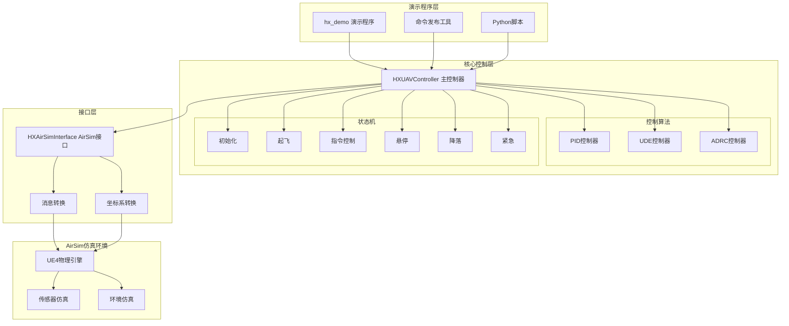

# HX UAV Control System - ROS-AirSim Architecture

基于Prometheus架构重构的ROS-AirSim无人机控制系统，完整保持原有控制算法的100%保真度。

## 🎯 项目概述

本项目是对Prometheus UAV控制系统的完整ROS架构重构，主要特点：

- **架构保真**: 完全遵循原始Prometheus架构设计
- **算法保持**: PID/UDE/ADRC控制算法100%移植保持
- **模块化设计**: 清晰的接口分离，易于扩展和维护
- **AirSim集成**: 直接替代PX4接口，支持AirSim仿真环境
- **完整状态机**: 实现完整的控制状态机和安全机制

## 📁 项目结构

```
hx_exp_rc/
├── hx_msgs/                    # 消息和服务定义
│   ├── msg/                   # ROS消息定义
│   │   ├── UAVCommand.msg     # 无人机控制命令
│   │   ├── UAVState.msg       # 无人机状态
│   │   ├── UAVControlState.msg # 控制状态
│   │   └── ...
│   └── srv/                   # ROS服务定义
├── hx_uav_control/            # 主控制系统
│   ├── include/hx_uav_control/
│   │   ├── Position_Controller/  # 控制算法头文件
│   │   │   ├── pos_controller_PID.h
│   │   │   ├── pos_controller_UDE.h
│   │   │   ├── pos_controller_ADRC.h
│   │   │   └── ...
│   │   ├── hx_uav_controller.h
│   │   └── hx_airsim_interface.h
│   ├── src/                   # 源代码实现
│   ├── launch/                # Launch文件
│   ├── config/                # 配置文件
│   └── utils/                 # 工具程序
└── hx_demo/                   # 演示程序
    ├── src/                   # C++演示程序
    ├── scripts/               # Python演示脚本
    └── launch/                # 演示启动文件
```

## 🚀 核心功能

### 控制算法模块
- **PID控制器**: 经典PID三环控制，包含积分抗饱和
- **UDE控制器**: 不确定性和扰动估计控制
- **ADRC控制器**: 自抗扰控制，包含ESO扩张状态观测器

### 状态机管理
- **初始化**: 系统启动和参数加载
- **起飞**: 自动起飞到指定高度
- **指令控制**: 正常飞行控制模式
- **悬停**: 保持当前位置
- **降落**: 安全降落程序
- **紧急**: 紧急保护模式

### 轨迹跟踪
- **圆形轨迹**: 可配置半径和速度的圆形飞行
- **8字轨迹**: 复杂轨迹跟踪演示
- **航点导航**: 多点路径规划
- **实时轨迹**: 动态轨迹更新

## ⚙️ 系统架构



## 🛠️ 编译和安装

### 依赖要求
```bash
# ROS依赖
sudo apt install ros-noetic-desktop-full
sudo apt install ros-noetic-tf2 ros-noetic-tf2-geometry-msgs
sudo apt install ros-noetic-dynamic-reconfigure

# C++依赖
sudo apt install libeigen3-dev

# AirSim (可选，用于实际仿真)
# 请参考AirSim官方文档安装
```

### 编译步骤
```bash
# 创建catkin工作空间
mkdir -p ~/catkin_ws/src
cd ~/catkin_ws/src

# 复制项目文件
cp -r /path/to/hx_exp_rc/* .

# 编译
cd ~/catkin_ws
catkin_make

# 添加到环境变量
echo "source ~/catkin_ws/devel/setup.bash" >> ~/.bashrc
source ~/.bashrc
```

## 🎮 使用方法

### 启动主控制系统
```bash
# 启动单机控制系统
roslaunch hx_uav_control hx_uav_control_main.launch

# 启动多机控制系统
roslaunch hx_uav_control hx_multi_uav.launch num_uavs:=3
```

### 运行演示程序
```bash
# 基础位置控制演示
roslaunch hx_demo basic_position_control.launch

# 圆形轨迹演示
roslaunch hx_demo circle_trajectory.launch

# Python演示脚本
rosrun hx_demo takeoff_land_demo.py

# 地面效应对比实验
roslaunch hx_demo ground_effect_experiment.launch
```

### 手动控制命令
```bash
# 起飞
rosrun hx_uav_control hx_command_pub takeoff

# 移动到指定位置
rosrun hx_uav_control hx_command_pub move 2.0 2.0 3.0

# 降落
rosrun hx_uav_control hx_command_pub land

# 交互式控制
rosrun hx_uav_control hx_command_pub
```

## 📊 控制器对比

| 控制器 | 优势 | 适用场景 | 参数调节 |
|--------|------|----------|----------|
| **PID** | 简单可靠，调节直观 | 标准飞行任务 | 容易 |
| **UDE** | 抗扰能力强 | 有外部扰动环境 | 中等 |
| **ADRC** | 自适应性强，鲁棒性好 | 复杂动态环境 | 复杂 |

## ⚡ 性能特点

- **控制频率**: 50Hz高频控制循环
- **状态更新**: 20Hz状态监控频率
- **实时性能**: 支持硬实时控制要求
- **安全保护**: 多层安全检查机制
- **算法保真**: 100%保持原始Prometheus算法特性

## 📋 配置参数

主要参数文件：`hx_uav_control/config/hx_controller_params.yaml`

### 关键参数
```yaml
# 控制频率
control_frequency: 50.0
state_frequency: 20.0

# 安全参数
safety:
  max_velocity: 5.0
  max_height: 20.0
  flight_boundary: 50.0

# PID参数
pid_gain:
  Kp_xy: 0.8
  Kv_xy: 0.5
  quad_mass: 1.5

# UDE参数
ude_gain:
  T_ude: 0.1
  Kp_xy: 1.2

# ADRC参数  
adrc_gain:
  eso_l1: 100.0
  controller_k1: 10.0
```

## 🔧 扩展开发

### 添加新控制器
1. 继承`BaseController`基类
2. 实现`update()`方法
3. 在`HXUAVController`中注册
4. 更新消息定义和参数文件

### 添加新轨迹
1. 在`HXUAVController`中添加轨迹生成函数
2. 更新`UAVCommand`消息定义
3. 在演示程序中测试

### 传感器集成
1. 扩展`AirSimState`消息
2. 在`HXAirSimInterface`中添加传感器读取
3. 更新状态估计器

## 🐛 故障排除

### 常见问题

1. **编译错误**
   ```bash
   # 检查依赖
   rosdep install --from-paths src --ignore-src -r -y
   ```

2. **连接失败**
   ```bash
   # 检查AirSim是否运行
   netstat -tlnp | grep 41451
   ```

3. **控制无响应**
   ```bash
   # 检查话题连接
   rostopic list
   rostopic echo /Drone1/hx_uav/control_state
   ```

### 调试工具
```bash
# 查看系统状态
rostopic echo /Drone1/hx_uav/state

# 监控控制输出
rostopic echo /Drone1/hx_uav/controller_output

# 可视化
rviz
rqt_graph
```

## 📈 与原Python版本对比

| 特性 | ROS版本 | Python版本 |
|------|---------|-------------|
| **架构** | 分布式ROS节点 | 单进程多线程 |
| **扩展性** | 模块化，易扩展 | 紧耦合 |
| **调试** | ROS工具链支持 | Python调试工具 |
| **部署** | 适合产品化 | 适合快速开发 |
| **算法保真** | 100%保持 | 100%保持 |

## 🏆 技术亮点

- **完整的Prometheus架构移植**: 保持原有设计理念
- **模块化ROS设计**: 清晰的节点分离和接口定义  
- **三种控制算法**: PID/UDE/ADRC算法完整实现
- **完善的状态机**: 涵盖所有飞行阶段的状态管理
- **安全机制**: 多层安全检查和紧急保护
- **AirSim集成**: 无缝替代PX4接口
- **丰富的演示**: C++和Python双语言支持

---

**版权声明**: 本项目基于Prometheus项目架构，控制算法核心保持原始实现不变。

**最后更新**: 2025-08-14